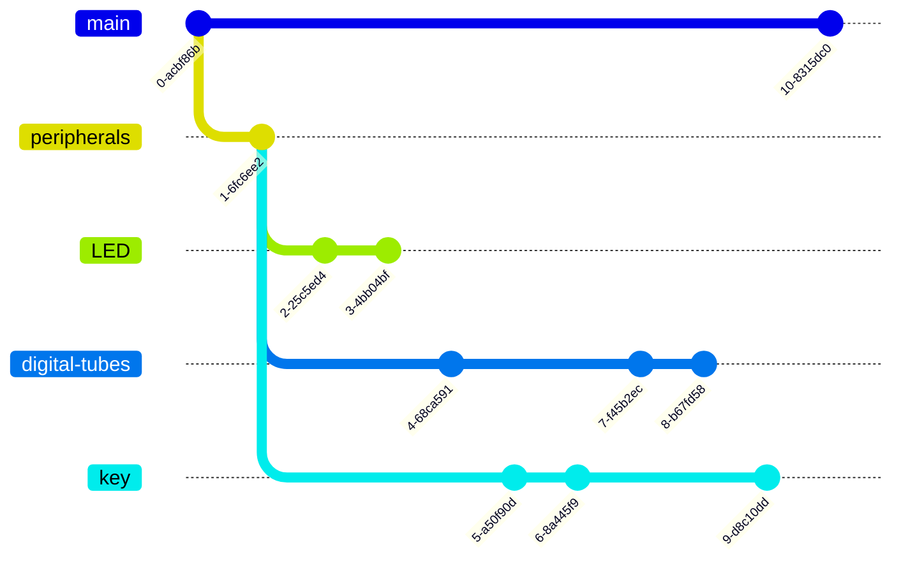

# C51 单片机的例程实验 

  跟随 b 站尚硅谷的教程来重温 51 单片机。原理性学习准备跟哈工大的单片机原理，当然肯定得有空才去看，目前还是先熟练应用，找到工作要紧。

  应该后续就一直使用这一个仓库来记录所有例程实验，不兼容的例程放到不同分支，每个相关的例程系列都应给出一个最终版本。比如 led 是直接从 main 分支开始的，最后版本完成时应转到 led 分支，并打上 tag: final version of LED。

## 仓库组织结构

这几天又重新学了下 git ，了解了分支模型和对象模型，感觉是不是得重建一个仓库了（笑）。准备让仓库的分支结构如下图：

每个分支如果结束了，就在最后的结束提交上打个标签，格式如：$branch-name finality。再考虑到不同的分支可能会调整 README 文件里的描述，但是每次修改又得 checkout main 才能修改，十分麻烦。所以考虑在每个分支里单独添加一个README.md，然后再回到初始提交里，给README添加分支的README文件记录。
